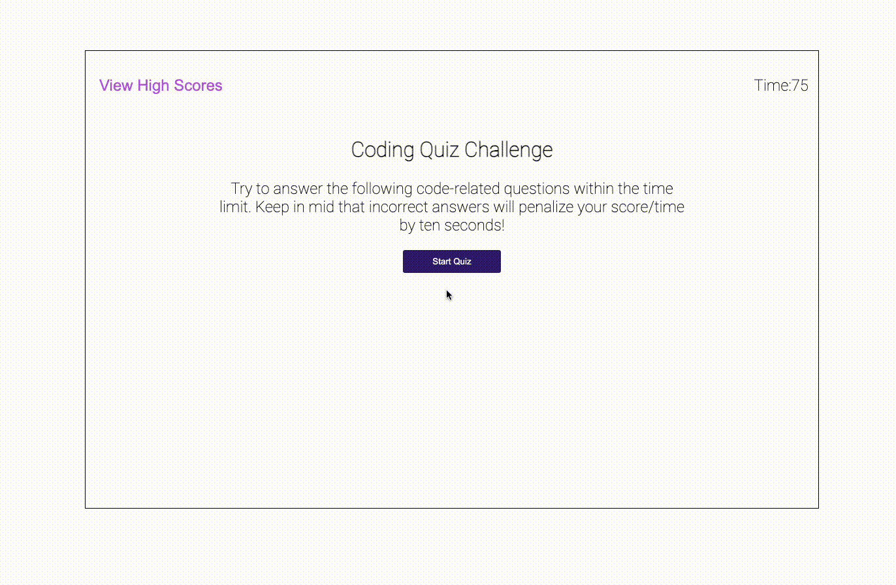

# Code Quiz

Welcome to the Code Quiz repository! This project is an interactive quiz designed to evaluate your knowledge in JavaScript, CSS, and HTML through a user-friendly and dynamic user experience.

## Features

- **Number of Questions:** The quiz consists of 5 questions, covering JavaScript, CSS, and HTML.
- **Limited Time:** You have 75 seconds to complete the quiz, adding a pressure element to test your knowledge under time constraints.
- **Web Interface:** The quiz is available on a webpage, providing an intuitive and easy-to-use interface designed for a smooth and enjoyable user experience. Visit the quiz at [Code Quiz](https://ponchobt.github.io/Code-Quiz/).
- **High Scores List:** After completing the quiz, you can view a list of high scores, allowing you to compare your results with those of other users. This adds a competitive element to the project.

## How to Play

1. **Visit the Web Page:** First, navigate to the Code Quiz page using the provided link: [Code Quiz](https://ponchobt.github.io/Code-Quiz/).
2. **Start the Quiz:** Upon arrival, the quiz will automatically begin after a brief introduction. Be prepared to answer the questions as quickly and accurately as possible.
3. **Answer Questions:** Select the answer you believe is correct for each of the 5 questions. Remember, time is limited, so every second counts.
4. **View High Scores:** After finishing the quiz, you'll have the option to view the high scores list. Click on "View High Scores" to see how your score compares to other users.

